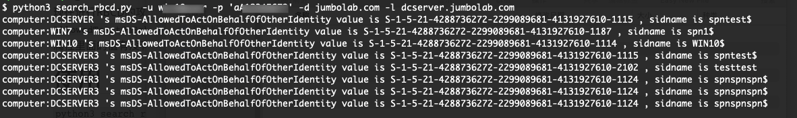

# 前言

现在进行RBCD的攻击手段主要是搜索`mS-DS-CreatorSID`，如果机器的创建者是我们可控的话，那就可以修改对应机器的`msDS-AllowedToActOnBehalfOfOtherIdentity`，利用工具[SharpAllowedToAct-Modify](https://github.com/Jumbo-WJB/SharpAllowedToAct-Modify)

那我们索性也试试搜索所有计算机并查看其`msDS-AllowedToActOnBehalfOfOtherIdentity`属性，里面的值有没有咱们可控的机器/账号，如果有的话，直接RBCD打就行。

# 使用

`python3 search_rbcd.py  -u ldapusername -p 'ldappassword' -d domain.com -l ldapserver.domain`

